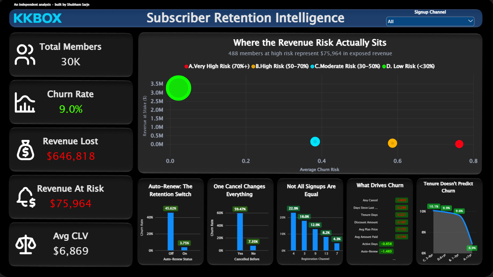
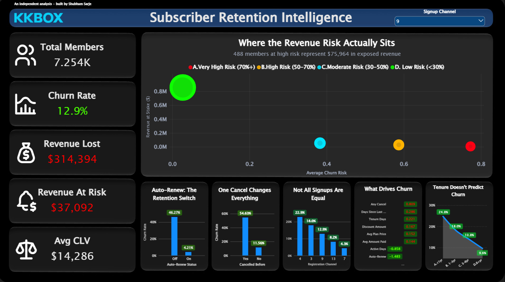
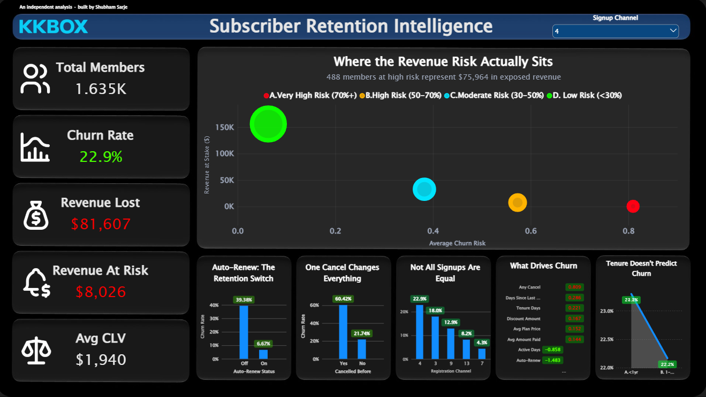

# Subscriber Retention Intelligence

**Finding $75,964 in recoverable revenue before it walks out the door — a real churn prediction system built on 30,000 real subscribers**

An end-to-end analysis of subscriber churn: a Python-built classification model, structured SQL analysis, and a fully interactive dashboard — shipped both in Power BI and as a live web app — identifying not just *who* is at risk, but *why*, and exactly what it's worth to act on it.

> **About the data:** this uses the KKBox Churn Prediction dataset (WSDM Cup) — real, anonymized subscriber data from KKBox, a real subscription music streaming service. KKBox is based in Asia, but the retention mechanics analyzed here are universal to any subscription business — the same dynamics apply to Spotify, Netflix, or a Canadian telecom's streaming add-on. Sampled to 30,000 members (stratified to preserve the real 8.99% churn rate) for portfolio scope.

**Tools:** Python (pandas, scikit-learn) · PostgreSQL (Supabase) · Power BI · React (live dashboard)
**Techniques:** ETL and feature engineering on real messy data, memory-safe processing of an 18M-row log file, logistic regression classification, DAX measures and calculated tables, interactive filtering

---

## [Live Web Dashboard](https://subscriber-retention-dashboard.vercel.app) · [Dashboard screenshots](#the-dashboard) · [GitHub](.)

---

## The headline

| Metric | Value |
|---|---|
| Members analyzed | 30,000 (stratified sample) |
| Real churn rate | 8.99% |
| Revenue already lost | **$646,818** |
| Revenue at risk (actionable) | **$75,964** across 488 members |
| Model precision on churned class | 75% |
| Model recall on churned class | 58% |
| Estimated customer lifetime value | ~$6,400–$6,900 |

**The conclusion in one sentence:** churn in this business is driven almost entirely by subscription mechanics — auto-renew status and cancellation history — not by how much a customer actually uses the product.

---

## Contents

- [Business context](#business-context)
- [Business questions](#business-questions)
- [The dataset](#the-dataset)
- [Analysis walkthrough](#analysis-walkthrough)
- [The dashboard](#the-dashboard)
- [Exceptions and limitations](#exceptions-and-limitations)
- [Recommendations](#recommendations)
- [Method](#method)
- [Repository structure](#repository-structure)
- [About](#about)

---

## Business context

Subscription businesses live or die on retention. A small, identifiable group of at-risk subscribers can represent a disproportionate share of revenue at stake — but only if a business can tell *who* they are, *why* they're at risk, and *what it's worth* to intervene, before they leave rather than after.

This project builds that capability end-to-end: a real predictive model, a structured analysis of what actually drives churn, and an interactive tool a retention team could use to prioritize outreach.

## Business questions

1. Can churn be predicted from a subscriber's behavior and account data — and how good does that prediction actually need to be?
2. What genuinely drives churn — engagement, subscription mechanics, demographics, or something else?
3. Where does churn risk concentrate, and how much revenue does that represent?
4. What would it be worth to act on this — in dollars, not just percentages?

## The dataset

**Source:** the *KKBox Churn Prediction* dataset, released for the WSDM Cup research competition.

**Nature of the data:** this is real, anonymized subscriber data from KKBox, an actual music streaming company — not a synthetic or sample dataset. It includes real member records, real billing transactions, and real daily listening logs.

**Why this dataset:** real customer-level churn data from named companies is almost never publicly available, for good reason — it's commercially sensitive and full of PII. KKBox is a rare, legitimate exception, released specifically for academic research. The alternative — synthetic "sample" churn datasets — are common in portfolios but aren't real; this project prioritizes working with genuine data over geographic familiarity.

**Scope:** the full dataset is enterprise-scale (millions of members, tens of millions of transaction and log rows). For a portfolio-scale project, a stratified sample of 30,000 members was drawn, preserving the real population's 8.99% churn rate exactly.

| | |
|---|---|
| Members sampled | 30,000 |
| Real churn rate | 8.99% (2,697 churned / 27,303 retained) |
| Transaction records | ~35,000 |
| Engagement log records | ~417,000 (filtered from an 18.4M-row source file) |
| Features engineered | 15 |

## Analysis walkthrough

### Step 1 — Acquire and sample (Python)

Pulled the KKBox dataset via the Kaggle API. Rather than processing the full multi-gigabyte dataset, drew a stratified 30,000-member sample preserving the real churn rate — a deliberate, disclosed scoping decision.

### Step 2 — Clean and merge (Python)

Real data arrives messy. ~11.6% of sampled members had no matching billing record; over half had missing or invalid demographic fields. Rather than dropping rows or silently imputing values, missingness was investigated, documented, and — where it carried signal — turned into a feature (`has_demo_info`).

The 18.4-million-row engagement log file was processed in memory-safe chunks (1 million rows at a time), filtering to only the sampled members as each chunk was read — never loading the full file into memory at once.

### Step 3 — Feature engineering (Python)

Built 15 features spanning subscription behavior (auto-renew, cancellation history), tenure and recency, billing patterns, and engagement (active days, listening volume, skip ratio).

### Step 4 — Modeling (Python, scikit-learn)

Trained a logistic regression classifier on a stratified 80/20 train/test split. Evaluated on precision and recall for the churned class specifically, not raw accuracy — a "predict nobody churns" baseline would already score ~94% accuracy on this imbalanced data while being useless.

**Result:** 75% precision, 58% recall on the churned class. Feature importance from the model independently confirmed exploratory findings: auto-renew and cancellation history dominate; raw listening volume is close to irrelevant.

### Step 5 — Structured analysis (SQL, PostgreSQL/Supabase)

Loaded the cleaned, feature-engineered, and model-scored data into a PostgreSQL database. Wrote structured queries answering the core business questions — churn by segment, revenue at risk by tier, customer lifetime value. See `sql/` and the [Query reference](FINDINGS.md#query-reference) in the findings log.

### Step 6 — Interactive dashboard (Power BI + live web app)

Built "Subscriber Retention Intelligence" — an 11-visual, fully interactive Power BI dashboard connected to the same underlying data. Every visual, including a hero bubble chart mapping risk tiers by revenue exposure, responds live to a channel filter.

The same design was then rebuilt as a standalone **React web app** (`web/`), deployed live on Vercel — so the dashboard is explorable by anyone with a browser, not just from screenshots. Same underlying figures as the Power BI build, verified query-by-query against Supabase.

---

## The dashboard

**Explore it live:** **[subscriber-retention-dashboard.vercel.app](https://subscriber-retention-dashboard.vercel.app)** — every KPI, the hero bubble chart, and all five supporting panels recalculate in real time as you switch between signup channels. Screenshots below for reference in case the link ever goes down.



*Filtered to Channel 9 (12.9% churn — a moderately elevated segment):*



*Filtered to Channel 4 (22.9% churn — the worst-performing channel):*



Every KPI, the hero bubble chart, and all five supporting panels recalculate live as the channel filter changes — this is a working, interactive tool, not a static export.

---

## Exceptions and limitations

- **This analysis uses a sample**, not the full dataset — disclosed explicitly, not hidden. The sample preserves the real population's churn rate exactly.
- **CLV is retrospective**, not a forward-looking discounted projection. It measures value generated so far.
- **The demographic-completeness finding is reported, not explained.** Members who completed their profile churn at roughly double the rate of those who didn't — a genuine, surprising result this analysis surfaces without claiming to know why.
- **Revenue-at-risk figures are directional, not exact** — average revenue is mildly higher in flagged risk tiers than in the low-risk tier, likely because pricing fields were also model inputs.
- **Not every channel spans every tenure cohort** — when filtered to a smaller channel, the tenure chart may show fewer than four bands. This is correct behavior, not a bug: it reflects that channel's actual member composition.

## Recommendations

| # | Action | Basis |
|---|---|---|
| 1 | Prioritize outreach to the 488 high/very-high-risk members | $75,964 in directly identifiable, actionable revenue |
| 2 | Investigate acquisition quality on Channel 4 | 22.9% churn vs. 4.3% on the largest channel |
| 3 | Focus retention efforts on subscription mechanics (auto-renew enrollment, cancellation friction), not engagement campaigns | Engagement volume does not predict churn; subscription behavior does |
| 4 | Investigate why profile-completion correlates with higher churn | Counterintuitive, unexplained, and currently untested |

## Method

**Approach:** acquire and clean real data → engineer features → build and honestly evaluate a predictive model → structure the analysis in SQL → present it as an interactive tool, both in Power BI and as a live web app.

**Validation:** the model's feature importance independently reproduced findings first discovered through manual exploration — auto-renew and cancellation history as dominant drivers, engagement volume as noise. That agreement across two independent methods is the strongest evidence the findings are real.

**Techniques used:**

| Technique | Applied in |
|---|---|
| Memory-safe chunked processing | Filtering an 18M-row file without a full load |
| Feature engineering | Tenure, recency, billing behavior, engagement patterns |
| Classification modeling | scikit-learn logistic regression |
| Precision/recall evaluation | Chosen over accuracy for an imbalanced classification problem |
| SQL aggregation and grouping | Segment-level churn and revenue analysis |
| DAX measures and calculated tables | Power BI, including dynamic filtering across all visuals |
| Interactive dashboard design | Slicer-driven, fully recalculating KPIs, charts, and a bubble chart — shipped in both Power BI and as a live React web app |

## Repository structure

```
subscriber-retention-intelligence/
├── README.md              # This file
├── FINDINGS.md            # Full findings log
├── notebooks/
│   └── 01_clean_explore_model.ipynb   # Python: acquisition, cleaning, features, model
├── sql/
│   ├── 01_churn_by_auto_renew.sql
│   ├── 02_churn_by_cancellation.sql
│   ├── 03_churn_by_channel.sql
│   ├── 04_churn_by_tenure.sql
│   ├── 05_revenue_at_risk.sql
│   └── 06_customer_lifetime_value.sql
├── powerbi/
│   ├── subscriber-retention-intelligence.pbix
│   └── subscriber-retention-intelligence.pdf
├── web/                   # Live React dashboard (deployed on Vercel)
│   ├── src/
│   ├── package.json
│   └── README.md
└── assets/
    ├── dashboard-all-channels.jpg
    ├── dashboard-channel-9.jpg
    └── dashboard-channel-4.jpg
```

---

## About

**Shubham Sarje** — Data & Business Analyst, Toronto

**Approach:** Start with a business question, follow the evidence rather than the assumption, and stop only when the recommendation is specific enough to act on.

**Background:** Accounting-trained (B.Com) with dual post-graduate analytics credentials (4.0 GPA, Durham College) — which is why margin, cost structure, and profitability analysis are natural territory. Currently a Technical & Customer Experience Analyst at Transcom.

**Toolkit:** SQL (PostgreSQL) · Power BI · Tableau · Excel *(certified)* · Python

[LinkedIn](https://linkedin.com/in/shubhamsarje) · shubham.s.sarje@gmail.com · Toronto, ON
